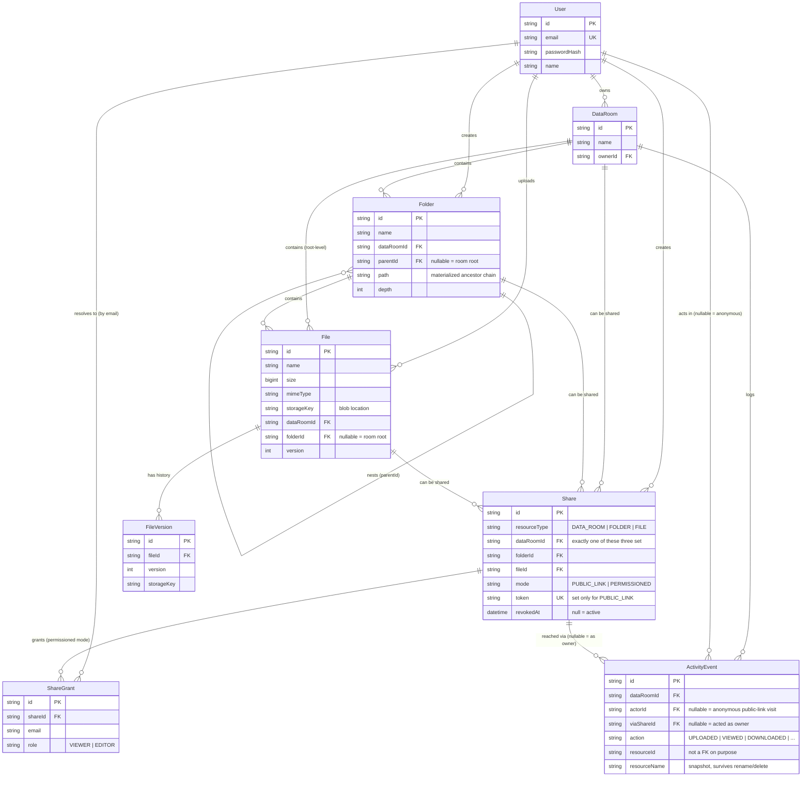

# [Vaultspace](https://github.com/superbodik/Vaultspace) — Data Room MVP

A virtual data room: a secure, organized place to upload, browse, and share deal
documents, with folders, granular sharing, and public/permissioned links.

**Hosted:**
- Frontend: http://202.181.188.159:8008 (moving to `kreez.space` behind Cloudflare)
- API: http://202.181.188.159:2475

Self-hosted on my own machine via Docker Compose (see [`docker-compose.yml`](docker-compose.yml)),
deployed as a custom Docker image through [PowerNode](https://github.com/superbodik/PowerNode)
(my own self-hosted server panel) and exposed to the internet through Cloudflare — not a
cloud PaaS. See [Deployment](#deployment) for both this path and the cloud-provider
alternative the repo is also set up for.

**Stack**: React 19 + TypeScript + Tailwind v4 (frontend) · NestJS + Prisma +
PostgreSQL (backend) · JWT cookie auth · pluggable blob storage (local disk /
S3-compatible).

```
apps/
  api/    NestJS backend — REST API, Prisma schema + migrations, file storage
  web/    React frontend — Vite, Tailwind, a small hand-rolled design system
```

---

## Table of contents

- [Design decisions](#design-decisions)
- [Setup instructions](#setup-instructions)
- [Data model / ERD](#data-model--erd)
- [How it scales](#how-it-scales)
- [A note on AI usage](#a-note-on-ai-usage)
- [Deployment](#deployment)

---

## Design decisions

**Auth: email/password over Google OAuth.** Both satisfy the requirement; email/password
needs no external OAuth app registration or client secrets, so anyone can clone the repo,
run one script, and get a working login in minutes — which matters more here than the
auth mechanism itself. JWT lives in an `httpOnly` cookie (not `localStorage`, to keep it
out of reach of XSS), and the `AuthUser`/`AccessContext` shape was designed to make it
easy to swap in a Passport Google strategy later without touching any resource logic.

**One backend "access" concept, not three.** Data rooms, folders, and files all need the
same question answered: *can this requester (owner / logged-in user / anonymous link)
view or edit this thing?* Rather than duplicating that check three times, `AccessService`
answers it once, walking up the resource's ancestor chain to find the owner or any active
share that covers it. Every controller (rooms, folders, files, search) calls into the same
service, so the sharing rules can't drift between resource types.

**Folders use a materialized path, not adjacency-list-only.** Each `Folder` stores
`path` (its ancestor IDs, e.g. `/roomRootId/financialsId/`) and `depth`, in addition to
`parentId`. Adjacency (`parentId`) is what you'd reach for by default, but it makes
"everything under this folder" (subtree size, cascading share-visibility, recursive
delete stats) an `O(depth)` recursive query. With `path`, the same question is one
indexed `LIKE 'prefix%'` scan — see [How it scales](#how-it-scales) for the concrete
query. Moving a folder rewrites its own row plus a single bulk `UPDATE` for descendants'
`path` prefixes, inside a transaction.

**Name conflicts: silent-resolve on upload/create, ask-first on rename/move.**
Dropping 10 files into a folder that already has 3 of the same name shouldn't block on
a dialog per file — new uploads and new folders silently become `name (1).pdf`. A
*rename* is a deliberate, single action, so instead of silently renaming *for* the user,
the API returns `409 Conflict` with a suggested alternative name and the UI offers it as
a one-click fix. Both paths share one naming utility (`common/utils/naming.ts`), and
uniqueness is also enforced with partial unique indexes at the database level (`WHERE
"parentId" IS NOT NULL` / `WHERE "parentId" IS NULL`, since a folder at the room root and
a nested folder have different notions of "sibling") as a second line of defense against
race conditions the app-level check can't fully rule out.

**Sharing is modeled as its own entity, not a flag on the resource.** A `Share` points at
*exactly one* of `dataRoomId` / `folderId` / `fileId`, has a `mode` (`PUBLIC_LINK` token or
`PERMISSIONED`), and owns zero or more `ShareGrant`s (one row per invited email, with a
`role`). This is what lets "share a data room" and "share one file three folders deep"
be the same code path, lets the owner revoke a link without touching the resource, and
is also the reason per-user roles are a column addition, not a remodel — see
[How it scales](#how-it-scales).

**Storage is an interface, not an AWS SDK call sprinkled through the codebase.**
`StorageService` delegates to a `LocalStorageDriver` (writes under `apps/api/uploads/`)
or an `S3StorageDriver` (any S3-compatible bucket — AWS, Supabase Storage, R2, MinIO),
selected by `STORAGE_DRIVER` at runtime. Local storage is the default so the app runs
fully offline with zero cloud accounts; flipping to S3 for production is an env var, not
a code change. Uploaded content is proxied through the API (not served directly from
storage), which is also where the access-control check for shared files happens.

**Local dev database: a real embedded Postgres, not SQLite.** The scaling questions in
this README (recursive path queries, partial unique indexes, `ILIKE` search) are
Postgres-specific, so the schema targets `postgresql` throughout — SQLite would have
made local dev slightly easier to *set up* but would have made the actual behavior
untested. Since this environment has no Docker, local dev instead boots
[PGlite](https://pglite.dev) (Postgres compiled to WASM) behind a real Postgres
wire-protocol socket server — `npm run db:up` — so the exact same `DATABASE_URL`-driven
Prisma code runs against a genuine Postgres locally and against a managed Postgres
(Neon/Supabase/RDS) in production. The one wrinkle: Prisma's Rust query/schema engines
speak a stricter subset of the wire protocol than PGlite's socket server implements, so
`PrismaClient` is wired through the official `@prisma/adapter-pg` (plain `pg` driver)
instead, and migrations are applied with a tiny driver-based runner
(`scripts/apply-migrations.ts`) rather than `prisma migrate dev`. Against a real Postgres,
none of this matters — `prisma migrate deploy` works as documented (see
[Deployment](#deployment)).

**Edge cases that shaped the schema/API, called out explicitly:**
- *Uploading a file with a name that already exists* → auto-suffixed, see above.
- *Deleting a folder that's open in someone else's shared view* → deletion is a real
  cascading `DELETE` (Postgres `ON DELETE CASCADE` on `Folder`→`Folder` and
  `Folder`→`File`), not a soft-delete flag. The viewer's next request for that folder or
  any file in it gets a real `404`, which the frontend renders as "you don't have access
  / this may have been removed" rather than a raw error.
- *Moving a folder into its own descendant* → rejected with a `400` (checked via the
  same `path` prefix used for subtree queries).
- *Two people sharing overlapping scopes* (e.g. the whole room *and* one folder in it) →
  `AccessService` takes the highest role granted by any covering share, so access is
  the union, not the last-write-wins.

**No code comments.** Identifiers are named for what they do; comments in this codebase
are reserved for the handful of places where the *why* genuinely isn't obvious from the
code (the ones you'll find are mostly flagging the PGlite/Prisma quirk above, or a
non-obvious ordering requirement).

---

## Setup instructions

Requires Node 20+. No Docker, no external accounts, no API keys — everything below runs
fully offline. (If you'd rather have Docker do all of this in one command, skip to
[Deployment → Self-hosted with Docker Compose](#a-self-hosted-with-docker-compose-whats-actually-running) —
same app, containerized, with a real Postgres instead of the local PGlite server below.)

```bash
git clone <this-repo>
cd <this-repo>
npm install                          # installs both apps/api and apps/web

cp apps/api/.env.example apps/api/.env
cp apps/web/.env.example apps/web/.env

# 1) start the local database (a real Postgres wire-protocol server, embedded — no install)
npm run db:up --workspace apps/api          # leave running in its own terminal

# 2) in a second terminal: create the schema and seed a demo account
npm run db:migrate --workspace apps/api
npm run db:seed --workspace apps/api
#   -> demo@acme.test / password123      (owns a sample data room)
#   -> reviewer@acme.test / password123  (for testing "share with a specific person")

# 3) start the API (third terminal)
npm run dev:api

# 4) start the frontend (fourth terminal)
npm run dev:web
```

Frontend: http://localhost:5173 · API: http://localhost:4000

Uploaded files land in `apps/api/uploads/` and the embedded database's data directory is
`apps/api/.pgdata/` — both are gitignored. Delete either to reset local state.

### Scripts reference (run from `apps/api`)

| Command | What it does |
|---|---|
| `npm run db:up` | Starts the embedded local Postgres (PGlite) on `:55432` |
| `npm run db:migrate` | Applies `prisma/migrations/*` via the `pg` driver (local/PGlite path) |
| `npm run db:migrate:deploy` | `prisma migrate deploy` — use this against a real Postgres |
| `npm run db:seed` | Seeds the two demo accounts + a sample data room |
| `npm run db:studio` | Opens Prisma Studio |

---

## Data model / ERD



Full schema with indexes: [`apps/api/prisma/schema.prisma`](apps/api/prisma/schema.prisma).

---

## How it scales

### How do you compute the total size and item count of a folder, including its whole subtree?

Every `Folder` stores a materialized `path` — the concatenated IDs of its ancestors, e.g.
a folder under `Financials` under the room root has `path = "/<financialsId>/"`. All
descendants of a folder `F` therefore share the prefix `F.path + F.id + "/"`, which is a
single indexed range scan:

```sql
-- descendant folder ids (apps/api/src/folders/folders.service.ts, descendantFolderIds)
SELECT id FROM "Folder"
WHERE "dataRoomId" = $1 AND path LIKE '<F.path><F.id>/%';
```

Then the subtree's file count/size is one aggregate over `File` filtered by
`folderId IN (F.id, ...descendantIds)`. This is what powers both the "browse" stats and
the delete-confirmation warning ("this deletes 3 folders and 12 files, 48 MB"). It's a
prefix-index lookup either way, not a recursive CTE walking parent pointers — the depth of
the tree doesn't change the query shape. The `Folder.path` index (`@@index([path])` in the
schema) is what makes the `LIKE 'prefix%'` scan cheap instead of a sequential scan.

Whole-room totals (no specific folder) skip the path lookup entirely — every `File.dataRoomId`
is set directly regardless of nesting, so it's `COUNT(*)`/`SUM(size)` filtered by
`dataRoomId` alone.

**Trade-off, named explicitly**: this recomputes on read. For a folder that's ~all of a
huge room, that's still a full-subtree scan per request. The next step if that shows up in
practice is denormalized counters (`itemCount`, `totalSize` columns on `Folder`, updated
incrementally on upload/delete/move) traded for O(depth) write cost instead of O(subtree)
read cost — reasonable once reads of a given folder's stats meaningfully outnumber writes
under it, which usually isn't true for a folder that's still being actively populated.

### What changes when one data room holds 100,000 files?

- **Listing/pagination.** `browse()` currently returns a folder's full immediate children
  in one response — fine at the hundreds scale a single folder realistically holds, wrong
  at 100k *total* files across a tree (which is many folders, not one giant flat list, so
  this is less dire than it sounds, but any given folder could still be large). The fix is
  keyset pagination on `(name, id)` — `WHERE (name, id) > ($lastName, $lastId) ORDER BY
  name, id LIMIT 50` — rather than `OFFSET`, which degrades linearly as the offset grows.
  `ItemTable`/`useBrowse` on the frontend are already isolated behind one hook, so this is
  a backend query change plus an infinite-scroll cursor in that one hook, not a rewrite.
- **Indexes.** `@@index([dataRoomId, folderId])` on `File` and `@@index([dataRoomId,
  parentId])` on `Folder` already cover "list this folder's contents." Keyset pagination
  needs `(dataRoomId, folderId, name, id)` to sort and page in the same pass. Search
  (`name ILIKE`) would move from `ILIKE` scans to a Postgres trigram (`pg_trgm` GIN) index
  or, past a few hundred thousand rows across many rooms, an external search index
  (Meilisearch/Typesense) fed by an outbox on file/folder writes.
- **Uploads.** Right now the API buffers each upload into memory before writing to storage
  — fine for the PDF-sized files this MVP targets, not for large files at volume. The real
  fix is presigned direct-to-S3 uploads (client gets a presigned PUT URL from the API,
  uploads straight to the bucket, then confirms with the API to create the `File` row) so
  large/many files never round-trip through the app server at all.
- **Delete cascades.** Deleting a folder with tens of thousands of descendants as one
  transaction risks long lock hold times. At that scale it becomes a background job: mark
  the folder tombstoned immediately (hidden from listings right away), sever it from its
  parent, and cascade-delete in batches off the request path.

### How does sharing extend to per-user roles (viewer/editor) without remodeling?

It mostly already is one: `ShareGrant.role` is a `VIEWER | EDITOR` enum today, but every
write endpoint currently checks `role === 'OWNER'` only, treating `EDITOR` as reserved.
Turning it on is:

1. Change the write-guard in `FoldersService`/`FilesService` from "owner only" to "owner or
   `EDITOR`-role share covering this resource" — `AccessService.resolveAccess` already
   computes and returns the effective role (`OWNER | EDITOR | VIEWER | NONE`) per request,
   it's just not consulted for mutations yet.
2. Let the share-creation UI pick a role per invite instead of hardcoding `VIEWER`
   (`SharesService.create` already stores whatever role it's given).
3. Decide the one real policy question this raises — whether an `EDITOR` on a folder can
   also invite others, and at what role — which is a permissions-policy decision, not a
   schema change.

No new tables, no migration: the polymorphic `Share` → `ShareGrant` shape (one row per
invited person per share, each with its own `role`) was chosen up front specifically so
"add a role" wouldn't be a remodel.

---

## A note on AI usage

Built with an AI pair (Claude, via Claude Code). The moments below are where it took
actual back-and-forth to get right, not a one-shot prompt:

- **Real, non-obvious debugging, not boilerplate.** Wiring Prisma against the embedded
  PGlite database surfaced a genuine incompatibility (Prisma's Rust engine vs. PGlite's
  socket server) that took an actual diagnostic loop to root-cause: raw TCP connect
  succeeded, the `pg` driver connected and queried fine, Prisma's CLI still failed with a
  generic "can't reach database" — the real error (`quaint::connector::postgres::native:
  UnexpectedMessage`) only showed up under `DEBUG=* prisma migrate dev`. That's what led to
  routing Prisma through the official `@prisma/adapter-pg` driver adapter instead of its
  bundled engine, and to writing the small SQL-file migration runner as the local-dev path.
  This is called out in code (`prisma.service.ts`, `scripts/apply-migrations.ts`) and above
  because it's the one place local dev and production genuinely diverge, and a future
  contributor deserves to know why before "simplifying" it back to `prisma migrate dev`.
- **The materialized-path folder model and the access-resolution algorithm**
  (`AccessService.resolveAccess` — reconciling owner / public-link-token / permissioned
  by-email access, each against the resource's own ancestor chain) were designed
  up front as the answer to the take-home's own scaling questions, then implemented and
  exercised against real requests (curl smoke tests for every endpoint, then a scripted
  Playwright pass through the actual UI — login, upload, share, revoke, anonymous
  public-link viewing in a logged-out browser context) to catch what a design pass alone
  wouldn't: an early version had a real access-control bug where folder-scoped shares
  were checked against the wrong resource id, and the Playwright pass also caught a
  redundant network request firing from a closed dialog.
- **Left as reviewable, not blindly accepted**: the naming-conflict resolution strategy
  (silent-resolve on create, ask-first on rename — see
  [Design decisions](#design-decisions)) was a UX call made and stated explicitly rather
  than defaulted to; same for choosing real cascading deletes over soft-deletes for the
  "folder being viewed while deleted" edge case.

---

## Deployment

Two ways to run this in production; the hosted instance above uses the first.

### A. Self-hosted with Docker Compose (what's actually running)

[`docker-compose.yml`](docker-compose.yml) at the repo root brings up all three
pieces — Postgres, the API, and the frontend behind nginx — as one unit, with no
external accounts needed:

```bash
cp .env.example .env   # edit JWT_SECRET, and API_PORT/WEB_PORT if 4000/5173 are taken
docker compose up -d --build
```

- `db`: `postgres:16-alpine` with a named volume, so data survives restarts.
- `api`: builds [`apps/api/Dockerfile`](apps/api/Dockerfile). On boot its entrypoint
  ([`apps/api/docker-entrypoint.sh`](apps/api/docker-entrypoint.sh)) runs
  `prisma migrate deploy` against the real Postgres container (no PGlite involved here —
  that workaround is local-dev-only, see [Design decisions](#design-decisions)) and, on
  first boot, seeds the demo account. Uploaded files live in a named volume
  (`STORAGE_DRIVER=local` by default; flip to `s3` + the `S3_*` vars for a real bucket).
  Published on `API_PORT` (default `4000`).
- `web`: builds [`apps/web/Dockerfile`](apps/web/Dockerfile) — a static Vite build served
  by nginx, with `VITE_API_URL` baked in at build time (Vite inlines `VITE_*` vars, so
  changing it means `docker compose build web` again, not just a restart). Published on
  `WEB_PORT` (default `5173`).

The hosted instance sits behind Cloudflare (moving to the `kreez.space` domain) and is
managed through [PowerNode](https://github.com/superbodik/PowerNode) on the host machine
rather than a cloud PaaS — the compose file itself has no opinion on that part, it just
needs a machine with Docker and whatever
reverse proxy/tunnel you point at its published ports.

### B. Cloud-hosted (Vercel + managed Postgres + S3), no infra of your own

1. **Database** — a Postgres instance on [Neon](https://neon.tech) or
   [Supabase](https://supabase.com) (both have a free tier). Copy the connection string.
2. **File storage** — any S3-compatible bucket: AWS S3, Supabase Storage, Cloudflare R2.
3. **Backend** (Render, Railway, Fly.io, or any Docker host) — build with
   [`apps/api/Dockerfile`](apps/api/Dockerfile) (`docker build -f apps/api/Dockerfile -t
   vaultspace-api .` from the repo root); set env vars from
   [`apps/api/.env.example`](apps/api/.env.example) (`DATABASE_URL` from step 1,
   `STORAGE_DRIVER=s3` + `S3_*` from step 2, a real `JWT_SECRET`, `CORS_ORIGINS` set to
   your frontend's URL). The image's entrypoint already runs `prisma migrate deploy` on
   boot, so no separate migration step is needed.
4. **Frontend** (Vercel) — import the repo, set **Root Directory** to `apps/web`; build
   command/output are auto-detected (Vite). Set `VITE_API_URL` to the backend's URL.
   [`apps/web/vercel.json`](apps/web/vercel.json) has the SPA rewrite so client-side
   routes (`/rooms/:id`, `/files/:id`, `/share/:token`) don't 404 on refresh.
5. **Point them at each other** — update the backend's `CORS_ORIGINS`/`WEB_PUBLIC_URL` to
   the live Vercel URL, and the frontend's `VITE_API_URL` to the live backend URL, then
   redeploy both.

---

## Extra credit implemented

- **Search & filtering** — by name across a data room (`GET /data-rooms/:id/search`),
  correctly scoped: an owner searches the whole room, someone with only a folder-level
  share searches only that folder's subtree (uses the same `path`-prefix mechanism as
  the stats query above).
- **File versioning** — "Upload new version" on an existing file archives the prior
  content as a `FileVersion` row and bumps `File.version`; the viewer's version-history
  panel lists and can open any prior version.
- **Activity log** — not asked for, added anyway because it's the one thing every real
  data room product (Datasite, DealRoom, Intralinks) is actually built around: the owner
  can see who viewed, downloaded, uploaded, renamed, moved, deleted, shared, or had access
  revoked, and when — including anonymous visits through a public link, shown as "Someone
  with the public link" rather than silently attributed to no one. `ActivityEvent` rows
  are deliberately not foreign-keyed to the resource itself (`resourceId` is a plain
  string, `resourceName` a snapshot at the time of the event), so the trail survives the
  file or folder it refers to being renamed or deleted later. Open it from the "Activity"
  button in a data room's toolbar (owner only).
